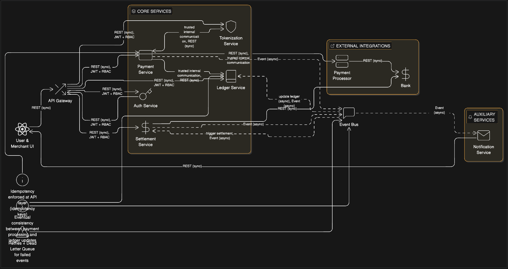
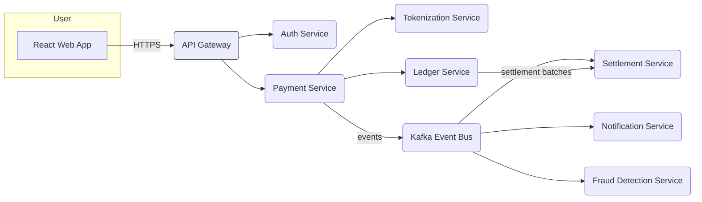

# PayFlow — End-to-End Payment Processing Platform

Status: Interview-grade reference implementation (cloud-agnostic)  
Audience: SDE-2 / FAANG-level backend & system-design interviews

---

## 1. Project Overview

PayFlow is a production-minded, cloud-agnostic payment processing platform inspired by systems such as Stripe and internal payments stacks used at large consumer platforms. It models real-world payment flows including:

- Authorization: reserve funds on a payment instrument.
- Capture: convert the reserved funds to a settled charge.
- Refund: return funds (full or partial) to the payer.
- Settlement: move money from acquirers to merchant accounts (batched).
- Reconciliation: match ledger entries with external settlement reports.

Note: AWS or any cloud provider is strictly an implementation/deployment choice and **not** part of the core design. All architecture and APIs are cloud-agnostic and can run on any provider or on-prem.

Goals:
- Demonstrate end-to-end payment lifecycle with strong correctness (ledger-first).
- Emphasize idempotency, correctness under concurrency, and event-driven integration.
- Provide interview talking points for both high-level (HLD) and low-level (LLD) design.

---


## 📐 System Architecture

### Logical Architecture (Cloud-Agnostic)

<p align="center">
  
</p>

This diagram represents the **logical system design** of PayFlow.
The system is cloud-agnostic and focuses on domain separation, event-driven processing,
and strong consistency guarantees for payments.


## 2. Key Learning Objectives

By building and discussing PayFlow you should be able to demonstrate:

- Java, Spring Boot, Spring Security (authentication, authorization).
- Kafka / event-driven architecture (producers, consumers, DLQ).
- SQL (PostgreSQL), Redis and ledger-based financial modeling.
- Idempotent REST APIs (Idempotency-Key patterns).
- Batch processing (Spring Batch) for settlement and reconciliation.
- System Design: Low-Level Design (LLD) and High-Level Design (HLD).
- Concurrency control, thread safety, and isolation strategies (optimistic/pessimistic locking).

---

## 3. Logical High-Level Architecture (Cloud-Agnostic)

A simple cloud-agnostic high-level view of components and interactions.



Service responsibilities (short):

- React Web App
  - Customer/merchant UI, collects payment details, renders status, sends idempotent requests.
- API Gateway
  - TLS termination, routing, rate-limiting, request authentication, metrics.
- Auth Service
  - OAuth2 / JWT provider for user and service auth; mTLS or signed JWTs for inter-service calls.
- Payment Service
  - Orchestrates authorization, capture, refund flows and emits events.
- Tokenization Service
  - Replaces raw payment details with tokens, stores secure metadata (PCI scope minimized).
- Ledger Service
  - Stores immutable ledger entries, exposes balance derivation and queries for reconciliation.
- Kafka Event Bus
  - Asynchronous message bus for domain events and eventual-consistency workflows.
- Notification Service
  - Sends emails/SMS/webhooks upon events (payment success/failure).
- Settlement Service
  - Batches ledger entries, posts to external acquirer or bank adapters, reconciles settlement reports.

---

## 4. Service Responsibilities & Interview Concepts

For each service: what it does + interview concepts it demonstrates.

- API Gateway
  - Function: Central ingress, routing, authentication enforcement, rate-limiting.
  - Concepts: Networking, TLS, rate-limiting algorithms (token bucket), caching, observability.

- Auth Service
  - Function: Identity provider, token issuance, RBAC, client credentials for services.
  - Concepts: Spring Security, OAuth2, JWT signing, key rotation, secure storage.

- Payment Service
  - Function: Main orchestrator — authorizations, captures, refunds; enforces idempotency and consistency.
  - Concepts: Spring Boot controllers, service layers, transactions, idempotency patterns, concurrency control.

- Tokenization Service
  - Function: Generates and validates payment tokens, maintains token lifecycle.
  - Concepts: PCI scope reduction, encryption-at-rest, secure key management patterns.

- Ledger Service
  - Function: Immutable ledger entries; derived balances; audit-first model.
  - Concepts: SQL design for append-only ledger, ACID transactions, indexing for performant aggregation.

- Kafka Event Bus
  - Function: Event propagation (payment.* topics), supports at-least-once delivery.
  - Concepts: Kafka topics/partitions, consumer groups, DLQ, exactly-once semantics considerations, idempotent consumers.

- Notification Service
  - Function: Delivery of emails, SMS, and webhooks for downstream systems.
  - Concepts: Retry strategies, exponential backoff, rate limits, webhooks security & signing.

- Settlement Service
  - Function: Batch settlement to acquirers, reconciliation with ledger and external reports.
  - Concepts: Spring Batch, transaction boundaries, eventual consistency, failure recovery.

---

## 5. Payment Service — Low Level Design (LLD)

High-level class responsibilities and flow.

Key classes:
- PaymentController (REST)
- PaymentService (transactional orchestration)
- PaymentProcessor (interface) — Strategy implementations:
  - CardProcessor, WalletProcessor, BankRedirectProcessor
- ProcessorFactory (creates PaymentProcessor by paymentMethod)
- TokenService (calls tokenization)
- LedgerClient (writes ledger entries)
- EventPublisher (Kafka producer)
- IdempotencyService (stores idempotency keys and responses)
- PaymentRepository (JPA/DAO)
- Domain models: Payment, PaymentStatus, PaymentMethod, PaymentRequest, LedgerEntry

Flow (Controller → Service → Processor):
1. PaymentController receives POST /payments/authorize with Idempotency-Key header.
2. Controller delegates to PaymentService.authorize(request, idempotencyKey).
3. IdempotencyService checks for existing response for key; if present return it.
4. PaymentService opens a DB transaction:
   - Create or fetch Payment entity with status PENDING.
   - Use ProcessorFactory to get PaymentProcessor for this payment method (Strategy).
   - Processor.authorize(...) executes external authorization with retries & timeouts.
   - On success: update Payment status AUTHORIZED, create immutable ledger entries via LedgerClient.
   - Persist state, commit transaction.
5. PaymentService publishes payment.authorized event (Observer pattern — subscribers react).
6. API returns 201 Created with payment resource and status.

Design patterns used:
- Strategy: PaymentProcessor implementations for different payment methods.
- Factory: ProcessorFactory to instantiate correct processor.
- Observer (Publish-Subscribe): EventPublisher publishes domain events to Kafka; consumers (Notification, Settlement) subscribe.
- Singleton: Configuration objects, KafkaProducer pool, and shared caches.
- Repository pattern for DB access.

Concurrency & Idempotency:
- Idempotency handled by IdempotencyService keyed by Idempotency-Key + user. Store request hash and canonical response. Clean-up TTL after retention period.
- Use optimistic locking (version field) for Payment table and SELECT ... FOR UPDATE in critical sections when moving from AUTHORIZED→CAPTURED to avoid double-capture.
- Database transactions (ACID) wrap state changes and ledger entries; ledger entries are append-only (immutable) for auditability.
- For distributed concurrency (multiple instances), rely on DB row-level locks or application-level distributed locks (e.g., Redis RedLock) for cross-service critical sections.

Thread-safety:
- Make PaymentProcessor implementations stateless or use thread-safe connection pools.
- Shared caches: use concurrent data structures or external cache (Redis) for atomic operations (INCR) if needed.

---

## 6. REST API Contracts

Common headers:
- Authorization: Bearer <jwt>
- Idempotency-Key: <uuid>
- Content-Type: application/json

1) POST /payments/authorize
- Description: Authorize (hold) funds for a payment.
- Request:
```json
{
  "amount": 1000,
  "currency": "USD",
  "paymentMethod": {
    "type": "card",
    "token": "tok_abcdef"
  },
  "capture": false,
  "metadata": { "orderId": "ord_123" }
}
```
- Response (201 Created):
```json
{
  "paymentId": "pay_01FZ...",
  "status": "AUTHORIZED",
  "authorizedAmount": 1000,
  "currency": "USD",
  "createdAt": "2026-02-07T15:04:05Z"
}
```
- HTTP statuses:
  - 201 Created (success)
  - 202 Accepted (async processing started)
  - 400 Bad Request (validation)
  - 401 Unauthorized
  - 409 Conflict (duplicate request without idempotency)
  - 422 Unprocessable Entity (business rule failure)
- Idempotency:
  - Provide Idempotency-Key. Repeated calls with same key return same logical result or a 409 if inconsistent.

2) POST /payments/{id}/capture
- Description: Capture previously authorized funds (full/partial).
- Request:
```json
{
  "amount": 1000,
  "metadata": { "notes": "finalize order" }
}
```
- Response (200 OK):
```json
{
  "paymentId": "pay_01FZ...",
  "status": "CAPTURED",
  "capturedAmount": 1000,
  "capturedAt": "2026-02-07T15:10:00Z"
}
```
- HTTP statuses:
  - 200 OK
  - 404 Not Found
  - 409 Conflict (already captured)
  - 422 Invalid capture amount
- Idempotency: Idempotency-Key applies to capture to avoid double-capture.

3) POST /payments/{id}/refund
- Description: Refund (full or partial) a captured payment.
- Request:
```json
{
  "amount": 500,
  "reason": "customer_request",
  "metadata": {}
}
```
- Response (200 OK):
```json
{
  "refundId": "ref_01FZ...",
  "paymentId": "pay_01FZ...",
  "status": "REFUNDED",
  "refundedAmount": 500,
  "createdAt": "2026-02-07T16:00:00Z"
}
```
- HTTP statuses:
  - 200 OK
  - 404 Not Found
  - 409 Conflict (over-refund)
  - 422 Unprocessable

4) GET /payments/{id}
- Description: Retrieve payment status and ledger summary.
- Response (200 OK):
```json
{
  "paymentId": "pay_01FZ...",
  "status": "CAPTURED",
  "amount": 1000,
  "currency": "USD",
  "ledgerBalance": 1000,
  "ledgerEntries": [
    { "entryId": "le_1", "type": "AUTH", "amount": 1000, "createdAt": "2026-02-07T15:04:05Z" },
    { "entryId": "le_2", "type": "CAPTURE", "amount": 1000, "createdAt": "2026-02-07T15:10:00Z" }
  ]
}
```
- HTTP statuses:
  - 200 OK
  - 404 Not Found

Notes:
- Use standard HTTP verbs and status codes. Use 202 for async operations when external dependencies (acquirers) are involved.
- All state-changing endpoints should accept and persist Idempotency-Key and return consistent responses for retries.

---

## 7. Database Design (Ledger-Based)

Core tables (simplified SQL DDL):

```sql
-- payments table
CREATE TABLE payments (
  id               UUID PRIMARY KEY,
  merchant_id      UUID NOT NULL,
  user_id          UUID,
  amount           BIGINT NOT NULL, -- store in minor units (cents)
  currency         CHAR(3) NOT NULL,
  status           TEXT NOT NULL, -- PENDING, AUTHORIZED, CAPTURED, REFUNDED, FAILED
  version          BIGINT NOT NULL DEFAULT 0, -- optimistic locking
  created_at       TIMESTAMP WITH TIME ZONE DEFAULT now(),
  updated_at       TIMESTAMP WITH TIME ZONE DEFAULT now(),
  metadata         JSONB
);

CREATE INDEX idx_payments_merchant_status ON payments (merchant_id, status);

-- ledger_entries table (append-only)
CREATE TABLE ledger_entries (
  id               BIGSERIAL PRIMARY KEY,
  payment_id       UUID REFERENCES payments(id),
  merchant_id      UUID NOT NULL,
  entry_type       TEXT NOT NULL, -- AUTH, CAPTURE, REFUND, FEE, SETTLEMENT
  amount           BIGINT NOT NULL,
  currency         CHAR(3) NOT NULL,
  reference        TEXT, -- external reference or acquirer id
  created_at       TIMESTAMP WITH TIME ZONE DEFAULT now(),
  metadata         JSONB
);

CREATE INDEX idx_ledger_payment ON ledger_entries (payment_id);
CREATE INDEX idx_ledger_merchant_time ON ledger_entries (merchant_id, created_at);
```

Why ledger-first and immutable entries:
- Financial correctness requires an append-only audit trail. Balances are derived by aggregating ledger entries, which makes reconciliation transparent and auditable.
- Avoids in-place mutable balances which are harder to reconcile and prone to drift.
- Immutable entries + transactionally persisted state ensure recoverability and audit.

ACID & Isolation:
- Use SERIALIZABLE or REPEATABLE READ where necessary for critical aggregation/reconciliation. For performance, use READ COMMITTED for general ops and stronger isolation for settlement/reconciliation jobs.
- Use optimistic locking (version column) for quick conflict detection; SELECT FOR UPDATE in capture flows when necessary.

Indexing:
- Index by payment_id, merchant_id, status, and created_at to support common queries (lookups, merchant balances, settlements).

Retention and archival:
- Keep ledger entries immutable; archive old entries to cheaper storage while keeping primary ledger for recent lookups.

---

## 8. Event-Driven Architecture

Kafka topics and purpose:

- payment.authorized
- payment.captured
- payment.failed
- payment.refunded
- settlement.completed

Producer responsibilities:
- Payment Service publishes events after transactional changes (preferably after DB commit).
- Use outbox pattern (DB outbox table) to atomically persist domain state and publish events to avoid lose/dup scenarios.

Consumer responsibilities:
- Notification Service: consume and notify customers/merchants.
- Settlement Service: aggregate captured ledger entries and create settlement batches.
- Reconciliation jobs: consume settlement.completed to mark entries as settled.

Delivery guarantees & reliability:
- Kafka default: at-least-once delivery. Consumers must be idempotent.
- Consider exactly-once semantics with Kafka transactions if required; simpler is at-least-once + idempotent consumers.
- Implement DLQ (dead-letter queue) for poison messages: e.g., payment.events.dlq.
- Implement retry/backoff on transient consumer failures.

Event schema:
- Use a versioned event envelope:
```json
{
  "eventId": "evt_...",
  "type": "payment.authorized.v1",
  "occurredAt": "2026-02-07T15:04:05Z",
  "payload": { ... }
}
```

Consistency model:
- Accept eventual consistency between services; design user-facing flows to reflect eventual state and provide deterministic transaction statuses via the ledger.

---

## 9. 8-Week Step-by-Step Build Plan

Week 1 — Project skeleton & core APIs
- What to build:
  - Spring Boot microservice scaffold.
  - PaymentController with POST /payments/authorize and GET /payments/{id}.
  - Minimal in-memory PaymentRepository (for local dev).
- Interview topics:
  - REST API design, Spring Boot controllers, DTOs, validation.

Week 2 — Persistence & Ledger
- What to build:
  - PostgreSQL integration, JPA entities for payments and ledger_entries.
  - Implement ledger append on authorization.
- Interview topics:
  - DB schema design, SQL best practices, migrations (Flyway).

Week 3 — Tokenization & Payment Processors
- What to build:
  - TokenizationService stub and PaymentProcessor interface + Card processor mock.
  - Implement Strategy + Factory.
- Interview topics:
  - Design patterns, interface-based design, dependency injection.

Week 4 — Idempotency & Concurrency
- What to build:
  - IdempotencyKey table & service, optimistic locking, unit tests for double-submit.
- Interview topics:
  - Idempotency patterns, concurrency controls, transactional semantics.

Week 5 — Eventing & Kafka
- What to build:
  - Kafka integration or Redpanda locally, event publisher, outbox pattern implementation.
  - payment.* events produced.
- Interview topics:
  - Event-driven architecture, outbox pattern, at-least-once semantics.

Week 6 — Settlement & Spring Batch
- What to build:
  - Settlement Service that reads ledger entries and creates settlement batches via Spring Batch.
  - Basic reconciliation job.
- Interview topics:
  - Batch processing, retries, chunking, long-running jobs.

Week 7 — Notifications & Webhooks
- What to build:
  - Notification Service consuming events, webhook delivery with signing.
  - Implement DLQ handling.
- Interview topics:
  - Pub/sub consumers, fault handling, webhooks security.

Week 8 — Security, Observability, and Load testing
- What to build:
  - Spring Security (JWT/OAuth2), rate limiting at API gateway, integration tests, metrics (Prometheus), distributed tracing (Jaeger).
  - Run load tests and optimize locking/contention hotspots.
- Interview topics:
  - Authentication/authorization, performance tuning, monitoring and troubleshooting.

Deliverables for interviews:
- Running system (locally or free cloud) + clean README + focused demo script with 3–5 scenarios: successful card auth+capture, partial refund, settlement reconciliation.

---

## 10. Free Tools & Hosting (No Paid Services)

Cloud-agnostic choices (free-tier / OSS) to host and test the system:

- Hosting / deployment:
  - Railway (free tier), Render (free tier), Fly.io (free tier)
  - Vercel for the React frontend
- Kafka:
  - Redpanda (local/hosted free tier) or Kafka via Confluent community locally
- Database:
  - PostgreSQL (free tier on providers or local)
- Cache / Locking:
  - Redis (free tier or local)
- CI/CD:
  - GitHub Actions (free for public repos, limited minutes for private)
- Local dev:
  - Docker Compose for local stacks
- Emulators & tooling:
  - LocalStack only if you choose AWS-backed testing (optional)
- Emphasize that the architecture is cloud-agnostic: every component can be run on any provider or self-hosted.

---

License
- MIT (or choose organization policy)

Contributing
- Include clear CONTRIBUTING.md, CODE_OF_CONDUCT.md and architecture decision records (ADRs) for major choices.

Contact
- Repository owner / maintainer: froster02
